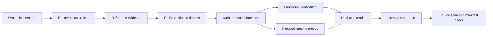

# Constraint-Aware Coding Agent Evaluation Lab

A fully synthetic Python lab for comparing functional correctness with independently observed implementation behavior.

> **Public provenance notice:** This is an independently authored portfolio project. It contains no employer or client code, prompts, task identifiers, datasets, tests, workflow documents, model outputs, credentials, internal metrics, or confidential artifacts. Every scenario, candidate, observation, and result was created specifically for this public demonstration.

This repository demonstrates evaluation-engineering techniques. It does not claim that the example was submitted to or merged into any third-party project.

## Why this project exists

Passing unit tests proves that selected outputs are correct. It does not establish every property of how those outputs were produced. A candidate may return the expected values while mishandling object identity, mutable inputs, one-shot iterables, injected dependencies, time snapshots, or stable ordering.

This lab reports two dimensions separately:

1. **Functional correctness:** Does the candidate satisfy the ordinary product tests?
2. **Constraint compliance:** Does it satisfy each declared behavior under a focused runtime probe?

The included comparison illustrates the difference. Both authored candidates pass the functional tests, while their constraint results differ.

## Included result

| Run | Functional tests | Constraint compliance | Overall |
|---|---:|---:|---:|
| Synthetic reference | PASS | 6/6 | PASS |
| Synthetic comparison | PASS | 2/6 | FAIL |

The generated compliance separation is 66.7 percentage points. This is an engineered educational result, not evidence about any external agent or commercial model.

## What I built

- A standalone synthetic scenario format
- Six deliberately varied behavior categories
- Ordinary tests that focus on returned product values
- Focused probes for iterable, identity, mutation, time, policy, and ordering semantics
- Fourteen accepted checks covering canonical and equivalent valid implementations
- Twelve isolated adversarial fixtures, each failing only its paired probe
- Two functionally failing candidates that prove targeted probes stay behavior-specific
- Temporary per-run workspaces and strict change-scope enforcement
- Dual-axis grading with structured evidence
- JSON and Markdown comparison reports
- Reproducible reference-diff and SHA-256 inventory generation
- Conservative source-tree privacy checks
- Multi-version continuous integration

## Data flow



## Repository map

```text
.
├── src/agent_eval_lab/       Evaluation engine and command-line interface
├── examples/notice_planner/  Fully synthetic case study
│   ├── scenario.*            Fictional problem and metadata
│   ├── constraints.json      Observable behavior contracts
│   ├── fixture/              Starter package and value-based tests
│   ├── reference_evidence/   Authored reference diff and observations
│   ├── probe_validation/     Isolated accepted/adversarial fixtures
│   └── candidate_runs/       Two authored comparison candidates
├── reports/example/          Reproducible sample outputs
├── tests/                    Engine and release-control tests
├── docs/                     Design and reproduction notes
└── tools/                    Reference, manifest, and source-scan helpers
```

## Quick start

Python 3.11 or newer is required. The evaluation runtime uses only the standard library.

The zero-install route requires no package download:

```bash
PYTHONPATH=src python -m agent_eval_lab validate examples/notice_planner
PYTHONPATH=src python -m agent_eval_lab check-probes examples/notice_planner
PYTHONPATH=src python -m agent_eval_lab evaluate examples/notice_planner
```

For the installed `agent-eval` command, create an environment and install the local package. Depending on the Python distribution, `pip` may need to obtain standard build tooling:

```bash
python -m venv .venv
source .venv/bin/activate
python -m pip install -e .
```

Persist machine-readable and Markdown reports:

```bash
agent-eval evaluate examples/notice_planner --output reports/generated
```

Run tests and release checks:

```bash
PYTHONPATH=src python -m unittest discover -s tests -v
python tools/check_public_release.py
python tools/check_manifest.py
```

## Synthetic case study

The fictional `notice_planner` package groups scheduled notices by a policy-resolved delivery channel. Ordinary tests verify returned values. Separate probes observe six behaviors:

| Constraint | Behavior category | Focused evidence |
|---|---|---|
| Consume the input once | Input protocol | A one-shot iterable rejects a second traversal |
| Preserve rejected identity | Object ownership | Every rejected object must be the original instance |
| Do not mutate inputs | State integrity | Instrumented objects record transient and nested writes |
| Snapshot the clock once | Time consistency | Real datetimes change classification across controlled snapshots |
| Delegate channel decisions | Dependency boundary | Unpredictable string policy results must become the actual routing keys |
| Preserve rejection order | Stable ordering | Interleaved rejection reasons retain input order |

Each adversarial validation fixture is single-fault: it fails its paired probe and passes the other five. Extra regressions cover transient object and nested-metadata mutation, ignored clock values, hybrid and partial local-policy logic, and call-then-ignore dependency use. Accepted fixtures also prove that equivalent direct, inverse, arithmetic, and timestamp-based clock comparisons and an extra policy lookup are not falsely rejected. A functionally incomplete candidate still passes the iteration, identity, and ordering probes, while a duplicate-output candidate still passes identity preservation. These checks demonstrate that targeted judgments do not depend on unrelated product completeness. The comparison candidate combines four realistic near-misses and still passes all ordinary functional tests.

## Safety boundary

Candidate code executes with the local Python process's permissions. Temporary workspaces provide file separation, not a security sandbox. Evaluate only trusted synthetic fixtures.

The public source scanner checks configured patterns in publishable text files. It intentionally excludes development caches, environments, build outputs, and version-control history. A private denylist can add organization-specific markers without committing them.

## Portfolio positioning

Use this as an **independent open-source portfolio project**. It becomes an open-source contribution only if work is later accepted into another public project.

Suggested portfolio description:

> Built an independent synthetic coding-agent evaluation lab that separates functional correctness from runtime constraint compliance using isolated adversarial probes, reproducible reports, and privacy-aware release checks.

## Documentation

- [Architecture](docs/architecture.md)
- [Methodology](docs/methodology.md)
- [Constraint design](docs/constraint-design.md)
- [Case study](docs/case-study.md)
- [Reproduction walkthrough](docs/walkthrough.md)
- [Privacy model](PRIVACY.md)
- [Source provenance](SOURCE_PROVENANCE.md)

## Limitations

This is a small deterministic teaching example, not a production benchmark. The candidates were authored to exercise evaluation paths. Results should not be generalized to other repositories, languages, agents, or models.

## License

[MIT](LICENSE)
