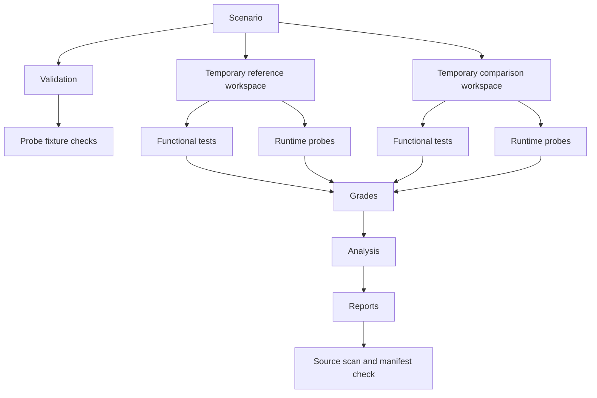

# Architecture

The public project uses five small layers.

## Scenario validation

`bundle.py` verifies the scenario identity across documents, required fields, safe relative paths, change permissions, evidence-key parity, declared runs, and reference-diff reproducibility.

## Temporary execution

`workspace.py` copies the fictional starter package into a temporary directory and applies a candidate's declared replacements. The directory separation protects the project fixture from accidental edits. It is not a security sandbox.

## Independent observations

`verifier.py` runs ordinary unit tests. `probes.py` separately observes one behavior per constraint. A probe exception becomes a failed result with evidence, allowing later probes to continue.

## Probe validation and grading

`probe_validation.py` checks one or more accepted and isolated adversarial fixtures per constraint. Every adversarial fixture must fail only its paired probe. It also verifies declared functional-test expectations, including a deliberately incomplete candidate used to prove axis separation. `grader.py` then evaluates each authored candidate on both dimensions.

## Reporting and release controls

`analysis.py` calculates compliance separation without blending it with correctness. `reporting.py` creates a readable report. `reference.py` reproduces the expected source diff. `manifest.py` inventories public files, and `privacy.py` checks configured source patterns.

